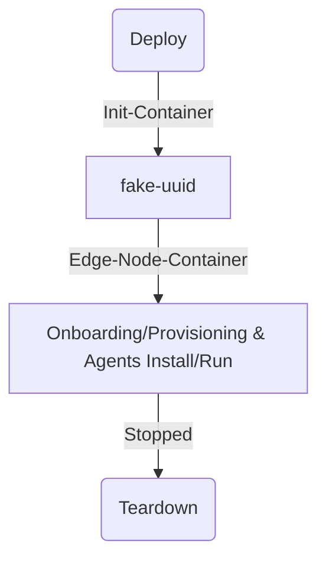

# Edge node in a container (ENiC)

Edge node in a container, internals and defails.

## Architecture

ENiC is described here given the structure of its helm chart package.
It contains the following containers, which are started in the order they are described below:

- Init-Container: this is the init container that performs the initialization of the fake-uuid script.
  It uses a dmiTemplate file to create a new UUID and Serial Number for the ENiC. This file is mounted
  in a shared volume with the other containers. The mount path specified is `/sys/firmware/dmi/tables/DMI`.
  This requires the container to run as sudo, and in privileged mode. It is required to execute the fake-uuid
  because when multiple ENiCs are deployed in the same machine they must not have the same UUID/Serial.
- Edge-Node-Container: this container is reponsible to perform the simulation of the onboarding/provisioning process
  of ENiC. Now, all the scripts it has are replaced with the golang implementation from EN-SIM that performs the
  onboarding/provisioning (IO/NIO) in golang. This container must be refactored to have its functionalities moved
  to the BMA container. It also performs the installation of Bare Metal Agents (BMA) `.deb` packages
  (and its dependencies) in run-time, and maintain them running along the execution of ENiC.
  This was required given that ENiC UUID/Serial are generated only when its init container is initialized.
  The installation of BMA packages require the sudo user.

Notice: Init-container has its separated Dockerfile.utils source.




## Workflows

See below the C4 component diagram of the simulated edge node.

```mermaid
C4Component
    title Component diagram EdgeNodeinContainer

    Container_Boundary(ensim, "ENiC") {
        Container_Boundary(fakedmi, "Fake DMI (Simulated)") {
            Component(fake, "Fake DMI Table", "Fake DMI Table", "Fakes UUID and Serial Number.")
        }
        Container_Boundary(onbprov, "Onboard/Provision (Simulated)") {
            Component(onboard, "Interactive Onboarding", "Interactive", "All interactive onboarding mechanisms.")
            Component(nio, "Non-Interactive Onboarding", "NIO", "All non-interactive onboarding mechanisms.")
            Component(prov, "Provisioning", "Tinkerbell worker", "Executes tinkerbell workflow actions.")
        }

        Container_Boundary(agents, "Agents") {
            Component(update-agent, "Update Agent", "Update Agent", "Updates maintenance status")
            Component(node-agent, "Node Agent", "Node Agent", "Updates host/instance status")
            Component(hd-agent, "HW Discovery Agent", "HDA", "Updates HW info")
            Component(telemetry-agent, "Telemetry Agent", "Telemetry Agent", "Set telemetry config")
            Component(cluster-agent, "Cluster Agent", "Cluster Agent", "Set cluster config")
        }
    }
    Container_Boundary(orch, "Orchestrator") {
        Container_Boundary(infra, "Edge Infrastructure Manager") {
            System_Ext(om, "Onboarding Manager", "Onboarding Manager")
            System_Ext(tinker, "Tinkerbell server", "Tinkerbell Workflows")
            System_Ext(mrm, "Maintenance Resource Manager", "MRM")
            System_Ext(hrm, "Host Resource Manager", "HRM")
            System_Ext(trm, "Telemetry Resource Manager", "TRM")
        }
        Container_Boundary(cluster, "Cluster Manager") {
          System_Ext(ecm, "Edge Cluster Manager", "Edge Cluster Manager")
        }
    }
    Rel(onboard, om, "CreateNodes", "gRPC")
    Rel(nio, om, "OnboardNodeStream", "gRPC")
    
    Rel(prov, tinker, "GetWorkflowContexts/ReportActionStatus", "gRPC")
    
    Rel(node-agent, hrm, "UpdateInstanceStateStatusByHostGUID", "gRPC")
    Rel(hd-agent, hrm, "UpdateHostSystemInfoByGUID", "gRPC")
    Rel(update-agent, mrm, "PlatformUpdateStatus", "gRPC")
    Rel(telemetry-agent, trm, "GetTelemetryConfigByGUID", "gRPC")
    Rel(cluster-agent, ecm, "GetClusterConfig", "gRPC")
  ```

The diagram above showcases the main components of ENiC, described in the list below.
And their workflows are described according to their functionalities.

- fake-uuid init container: it runs with `root` user, from a new uuid created at run-time, it performs the
  parsing of an actual DMI Table Template file, to overwrite it with the newly created uuid, and save a new
  DMI table to be used by ENiC. This new DMI table is mounted at `/sys/firmware/dmi/tables/DMI`. It means that
  when agents, such as hardware-discovery-agent, retrieve the edge node uuid from `dmidecode` they retrieve it from the
  mounted DMI Table generated by fake-uuid. This allows multiple ENiC instances to be executed in the same machine,
  because an edge node UUID must be unique in Infrastructure Manager.
- Onboarding/Provisioning in Edge-Node-Container: When the Edge Node Simulator was created,
  it was designed and implemented to use the same interfaces to onboard/provision an edge node as it is done in
  an actual scenario. This implementation is done in Golang.
  The Edge-Node-Container in ENiC uses this Golang implementaion of onboarding. Similarly, the same was done to
  Provisioning, where the Golang implementation simulates this process calling the same Infrastructure Manager
  interfaces as an actual edge node. This is performed using a systemd service called `onboard`.
- Agents Install/Execution in Edge-Node-Container: Before building the ENiC image, there is a Makefile target in the
  repository that downloads the `.deb` packages and its dependencies given an Edge Node Agents Manifest file.
  I.e., the same manifest file used in an actual edge node is used as reference to set the versions of the BMA
  packages installed in ENiC. These `.deb` packages are loaded
  into the container image used by the Edge-Node-Container.
  After the `.deb` packages are installed, their configuration in
  their respective files in `/etc/...` folder are properly set,
  e.g., the edge node UUID and the FQDN of the orchestrator.
  And then the agents are restarted, and operate normally under their systemd services.
  This process of install and execution of the agents is performed using a systemd service called `agents`.

Notice: look at the edge node simulator internals to learn more about
onboarding/provisioning [../../edge-node-simulator/docs/internals.md](../../edge-node-simulator/docs/internals.md).

## Utility

ENiC development reasons are related to:

- Fast Pipeline: it was extremely important that a fast CI pipeline was defined to validate onboarding/provisioning
  mechanisms of Infrastructure Manager, as well as the BMA agents installation and execution.
  Thus, ENiC now is part of the virtual integration
  pipeline of Infrastructure Manager releases.
- Lightweight image for scale tests: as the scale requirements of Infrastructure Manager were set,
  given a large set of edge nodes could not be used for scale tests (given its CPU/Memory/Disk requirements),
  ENiC was designed to be used to quickly be deployed and scaled in a Kubernetes cluster as a statefullset.

## Known Issues

The current implementation of ENiC has the following known issues:

- Multiple clusters: it is not possible to deploy more than one ENiC instance in a machine and have Kubernetes clusters
  deployed on them. A lot of investigation was done on this, and the root cause was not truly identified.
  But the issue is that only one of the clusters is properly functional.
  This was tested when clusters where created by Rancher using RKE2 as the reference kubernetes distribution.
- Fake-uuid: the need to fake UUID and Serial Number of edge nodes, given they are uniquely mandatory in Infrastructure Manager,
  makes the existence of the fake-uuid init container mandatory as well. This script is executed as `root` given
  its need to run the `dmidecode` tool. And it demands `privilege` mode in the container as it mounts the
  generated DMI Table in the path `/sys/firmware/dmi/tables/DMI` of the container.
