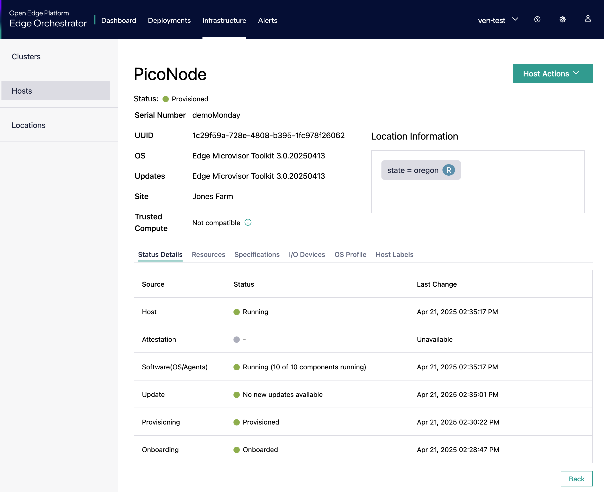

<!--
SPDX-FileCopyrightText: 2025 Intel Corporation

SPDX-License-Identifier: Apache-2.0
-->

# Pico Terraform Module 👌

This repository contains Terraform modules for provisioning virtual Edge Nodes
for the Open Edge Platform.

Pico means "small" in Spanish, and this module is designed to be lightweight
and efficient, making it ideal for creating Edge Nodes with minimal resource
usage very quickly.

## Features

- Lightweight: Designed for minimal resource usage 🪶
- Fast: Provisions an Edge Node E2E with Microvisor and all agents in minutes ⚡️
- Easy to use: Simple configuration with Terraform 🧘
- Highly configurable: Customize CPU, memory, disk size, and more 🔧
- Scalable: Easily scale up or down based on your needs 📈
- Cross platform: Deploy from Linux and Mac OS 🖥️
- Multiple onboarding options: Supports both interactive and non-interactive
onboarding methods 🔄
- All features of a hardware-backed Edge Node: Including dynamic OS
provisioning, agents, and Kubernetes 🚀

## Screenshots



## Common Requirements

- `dosfstools` package
  - Linux: `apt install dosfstools`
  - Mac OS: `brew install dosfstools`
- `curl` package
  - Linux: `apt install curl`
  - Mac OS: `brew install curl`
- `asdf` version manager:
  - Install [asdf](https://asdf-vm.com/guide/getting-started.html)
  - Run `asdf install` to install the required versions of tools
- An Open Edge Platform Orchestrator with a Tinkerbell Nginx URL
- **Note:** Ensure that the `http_proxy`, `https_proxy` and `no_proxy` environment variables are set correctly
for your network configuration. This variable should be set to include any necessary domains to bypass the proxy.

## Usage

### To use the Promox module

#### Prerequisites for Proxmox

- Proxmox Virtual Environment (PVE) v8.2 or newer with API access

#### Proxmox Interactive CLI

```shell
# Change directory to the Proxmox module
cd modules/pico-vm-proxmox

# Initialize the module
terraform init

# Apply the configuration
terraform apply
```

This will prompt you for the required variables. You can also provide them
via a `terraform.tfvars` file or as environment variables.

#### Terraform module

To use this module, include it in your Terraform configuration as follows:

```hcl
module "pico_vm" {
    source = "./modules/pico-vm-proxmox"

    vm_name           = "example-vm"
    vm_description    = "Example VM created with Pico module"
    datastore_id      = "local-lvm"
    proxmox_node_name = "pve-node"

    cpu_cores        = 16
    memory_dedicated = 16384
    disk_size        = "128G"

    smbios_serial    = "1234-5678-9012"
    smbios_uuid      = "abcd-efgh-ijkl-mnop"
    smbios_product   = "PicoVM"

    network_bridge = "vmbr0"
    network_model  = "virtio"

    tinkerbell_nginx_domain = "tinkerbell-nginx.your-orch-url.io"
}
```

#### Proxmox module outputs

- `vm_name`: The name of the created virtual machine
- `vm_id`: The ID of the created virtual machine
- `vm_serial`: The SMBIOS serial number of the virtual machine
- `vm_uuid`: The SMBIOS UUID of the virtual machine
- `tinkerbell_nginx_domain`: The Tinkerbell Nginx URL for the virtual machine

### To use the Libvirt module

#### Prerequisites for Libvirt

- Libvirt with KVM support
- xsltproc
  - Linux: `apt install xsltproc`
  - Mac OS: `brew install libxslt`

#### Libvirt Interactive CLI

```shell
# Change directory to the Proxmox module
cd modules/pico-vm-libvirt

# Initialize the module
terraform init

# Apply the configuration
terraform apply
```

This will prompt you for the required variables. You can also provide them
via a `terraform.tfvars` file or as environment variables.

#### Libvirt module

To use this module, include it in your Terraform configuration as follows:

```hcl
module "pico_vm" {
    source = "./modules/pico-vm-libvirt"

    vm_name           = "example-vm"

    cpu_cores        = 8
    memory           = 8192
    disk_size        = 128

    smbios_serial    = "1234-5678-9012"
    smbios_uuid      = "abcd-efgh-ijkl-mnop"
    smbios_product   = "PicoVM"

    libvirt_pool_name     = "default"
    libvirt_network_name  = "default"

    tinkerbell_nginx_domain = "your-nginx-url"
}
```

#### Libvirt module Outputs

- `vm_name`: The name of the created virtual machine
- `vm_serial`: The SMBIOS serial number of the virtual machine

### To use the KubeVirt module

#### Prerequisites for KubeVirt

- Kubernetes cluster with KubeVirt installed
- KubeVirt CLI (`virtctl`) installed

#### KubeVirt Interactive CLI

```shell
# Change directory to the KubeVirt module
cd modules/pico-vm-kubevirt

# Initialize the module
terraform init

# Apply the configuration
terraform apply
```

This will prompt you for the required variables. You can also provide them
via a `terraform.tfvars` file or as environment variables.

#### KubeVirt module

To use this module, include it in your Terraform configuration as follows:

```hcl
module "pico_vm" {
    source = "./modules/pico-vm-kubevirt"

    vm_name           = "pico-node"
    vm_namespace      = "default"

    cpu_cores         = 16
    memory_minimum    = 8Gi
    memory_limit      = 16Gi
    disk_size         = 110Gi

    smbios_serial     = "1234-5678-9012"

    tinkerbell_nginx_domain = "tinkerbell-nginx.your-orch-url.io"
}
```

#### KubeVirt module Outputs

- `vm_name`: The name of the created virtual machine
- `data_volume_name`: The name of the data volume created for the VM
- `tinkerbell_nginx_domain`: The Tinkerbell Nginx URL for the virtual machine

## Contributing

Contributions are welcome! Please submit an issue or pull request for any
improvements or bug fixes.
