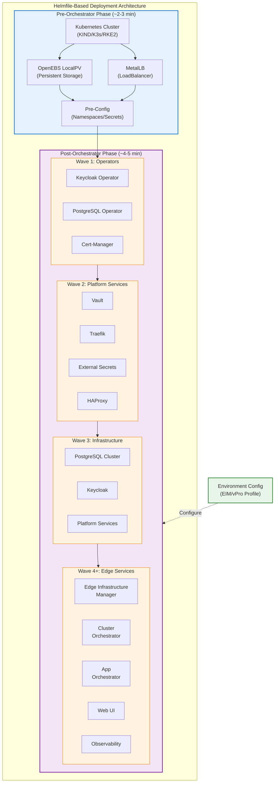
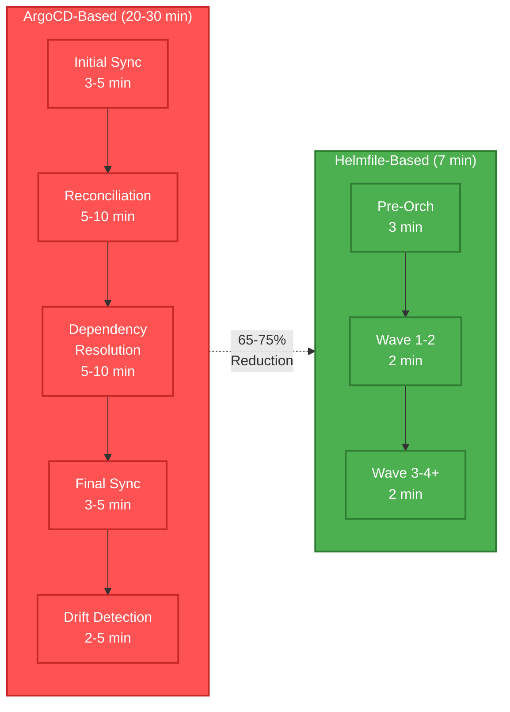

# Edge Manageability Framework: Helmfile-Based Deployment Migration

**Technical Whitepaper**

---

## Executive Summary

This whitepaper presents the architectural transition of the Edge Manageability Framework (EMF) from ArgoCD-based deployment to a streamlined Helmfile-based approach. This migration achieves significant performance improvements while maintaining the robustness and scalability required for enterprise edge orchestration deployments.

**Key Achievements:**
- **~7 minute total deployment time** for both pre-orchestrator and post-orchestrator phases
- **Two deployment profiles implemented**: EIM (Edge Infrastructure Manager) and vPro
- **Simplified operational model** with direct Helm chart releases
- **Maintained enterprise-grade features** including multi-tenancy, observability, and security

---

## 1. Introduction

### 1.1 Background

The Edge Manageability Framework provides comprehensive infrastructure and application management capabilities for distributed edge computing environments. The original deployment architecture relied on ArgoCD for GitOps-based continuous deployment, which introduced complexity and overhead for on-premises installations.

### 1.2 Migration Objectives

The helmfile-based deployment was developed to:
- **Reduce deployment time and complexity** for on-premises installations
- **Provide declarative, reproducible deployments** without continuous reconciliation overhead
- **Enable granular control** over component installation and configuration
- **Support multiple deployment profiles** for different edge use cases
- **Maintain compatibility** with existing infrastructure and tooling

---

## 2. Architecture Overview

### 2.1 Deployment Structure

The helmfile-based deployment is organized into two distinct phases:

```
helmfile-deploy/
├── pre-orch/          # Pre-orchestrator infrastructure setup
│   ├── pre-orch.sh
│   ├── helmfile.yaml.gotmpl
│   ├── openebs-localpv/
│   └── metallb/
└── post-orch/         # Orchestrator services deployment
    ├── post-orch-deploy.sh
    ├── helmfile.yaml.gotmpl
    ├── environments/
    │   ├── onprem-eim-features.yaml.gotmpl
    │   ├── onprem-eim-settings.yaml.gotmpl
    │   └── profile-vpro.yaml.gotmpl
    ├── values/
    └── hooks/
```

### 2.2 High-Level Architecture Diagram



### 2.3 Two-Phase Deployment Model

#### Phase 1: Pre-Orchestrator Setup
Establishes the foundational Kubernetes infrastructure and supporting services:
- **Kubernetes cluster provisioning** (KIND, K3s, or RKE2)
- **OpenEBS LocalPV** for persistent storage
- **MetalLB** for LoadBalancer services
- **Namespace and secret initialization**

#### Phase 2: Post-Orchestrator Deployment
Deploys the Edge Orchestrator platform and its components using a wave-based approach:
- **Wave 1**: Operators (Keycloak, PostgreSQL, Cert-Manager)
- **Wave 2**: Platform services (Vault, Traefik, External Secrets)
- **Wave 3**: Database clusters and platform infrastructure
- **Wave 4+**: Edge Infrastructure Manager, Cluster Orchestrator, Application Orchestrator, Observability, UI

---

## 3. Deployment Profiles

### 3.1 EIM Profile (Edge Infrastructure Manager)

The EIM profile provides comprehensive edge infrastructure lifecycle management capabilities for fleets of edge nodes.

**Enabled Components:**
- **Platform Services**: Auth, Cert Manager, Keycloak, Traefik, External Secrets, Vault
- **Database Infrastructure**: PostgreSQL Operator and Clusters
- **Edge Infrastructure Manager**: Core API, Managers (Host, Maintenance, Telemetry, OS Resource, Networking, Attestation), Onboarding services
- **Tenancy & Identity**: Multi-tenant management, Keycloak tenant controller, Nexus API Gateway
- **Web UI**: Admin, Infrastructure, and Root UI components
- **Observability**: Audit logging
- **Additional Features**: Certificate management, secrets handling, metadata broker

**Target Use Cases:**
- Secure remote onboarding of edge devices
- Policy-based lifecycle management of edge node fleets
- OS provisioning, upgrades, and inventory management
- Support for 1000+ edge nodes across distributed locations

### 3.2 vPro Profile (Modular Edge Infrastructure Manager)

The vPro profile is a specialized configuration optimized for Intel vPro-enabled devices, providing out-of-band management capabilities for up to 100 edge nodes.

**Profile Characteristics:**
- **Layered configuration**: Builds on EIM features with targeted overrides
- **Streamlined components**: Disables unnecessary services (Web UI, metadata broker)
- **vPro-specific enablement**: AMT (Active Management Technology) services including MPS (Management Presence Server), RPS (Remote Provisioning Server), and DM Manager
- **Skip OS provisioning**: Focuses on device management rather than OS lifecycle
- **Reduced manager set**: Only essential managers enabled (host-manager, while disabling maintenance, telemetry, OS resource, networking, attestation managers)

**Component Overrides:**
```yaml
infra-core:
  eimScenario: vpro
  skipOSProvisioning: true
  credentials: enabled
  apiv2: enabled (v1 disabled)
  inventory: enabled
  tenant-controller: enabled

infra-external:
  amt:
    mps: enabled
    rps: enabled
    dm-manager: enabled
```

**Target Use Cases:**
- Intel vPro device fleet management
- Out-of-band management and remote power control
- Simplified edge infrastructure for smaller deployments (up to 100 nodes)
- Scenarios requiring AMT-based device management

### 3.3 Profile Architecture Comparison

```mermaid
graph LR
    subgraph "EIM Profile Architecture"
        subgraph EIM_Platform["Platform Layer"]
            EIM_KC["Keycloak"]
            EIM_VAULT["Vault"]
            EIM_TRAEFIK["Traefik"]
            EIM_CERT["Cert Manager"]
        end
        
        subgraph EIM_Core["Core Services"]
            EIM_API["Infra Core API"]
            EIM_MGRS["All Managers<br/>(Host, Maintenance,<br/>Telemetry, OS,<br/>Network, Attestation)"]
            EIM_ONBOARD["Full Onboarding<br/>(PXE, Tinkerbell,<br/>OS Provisioning)"]
        end
        
        subgraph EIM_UI["User Interface"]
            EIM_WUI["Web UI<br/>(Admin, Infra, Root)"]
            EIM_META["Metadata Broker"]
        end
        
        EIM_Platform --> EIM_Core
        EIM_Core --> EIM_UI
    end
    
    subgraph "vPro Profile Architecture"
        subgraph VPRO_Platform["Platform Layer"]
            VPRO_KC["Keycloak"]
            VPRO_VAULT["Vault"]
            VPRO_TRAEFIK["Traefik"]
            VPRO_CERT["Cert Manager"]
        end
        
        subgraph VPRO_Core["Core Services"]
            VPRO_API["Infra Core APIv2"]
            VPRO_MGRS["Host Manager<br/>Only"]
            VPRO_ONBOARD["Limited Onboarding<br/>(No PXE/OS Prov)"]
        end
        
        subgraph VPRO_AMT["vPro Extensions"]
            VPRO_MPS["MPS<br/>(Mgmt Presence)"]
            VPRO_RPS["RPS<br/>(Remote Prov)"]
            VPRO_DM["DM Manager"]
        end
        
        VPRO_Platform --> VPRO_Core
        VPRO_Core --> VPRO_AMT
    end
    
    classDef eimStyle fill:#4caf50,stroke:#2e7d32,stroke-width:2px,color:#fff
    classDef vproStyle fill:#ff9800,stroke:#e65100,stroke-width:2px,color:#fff
    classDef platformStyle fill:#2196f3,stroke:#0d47a1,stroke-width:2px,color:#fff
    
    class EIM_Core,EIM_UI eimStyle
    class VPRO_AMT,VPRO_Core vproStyle
    class EIM_Platform,VPRO_Platform platformStyle
```



**Key Differences:**

| Component | EIM Profile | vPro Profile |
|-----------|-------------|--------------|
| **Target Scale** | 1000+ nodes | Up to 100 nodes |
| **Web UI** | ✅ Full (Admin, Infra, Root) | ❌ Disabled |
| **Managers** | ✅ All 6 managers | ✅ Host manager only |
| **OS Provisioning** | ✅ Full PXE/Tinkerbell | ❌ Skipped |
| **AMT Support** | ❌ Not included | ✅ MPS, RPS, DM Manager |
| **Metadata Broker** | ✅ Enabled | ❌ Disabled |
| **API Version** | v1 + v2 | v2 only |
| **Use Case** | Full lifecycle mgmt | Out-of-band device mgmt |

---

## 4. Performance Improvements

### 4.1 Deployment Time Analysis

**Previous ArgoCD-Based Deployment:**
- Initial sync and reconciliation overhead
- Sequential application dependencies with reconciliation loops
- Potential for sync failures requiring manual intervention
- Estimated total time: 20-30+ minutes

**Current Helmfile-Based Deployment:**
- **Pre-orchestrator phase**: ~2-3 minutes
  - Cluster setup (K3s/RKE2)
  - OpenEBS LocalPV installation
  - MetalLB configuration
- **Post-orchestrator phase**: ~4-5 minutes
  - Wave-based component deployment
  - Parallel release installation within waves
- **Total deployment time**: **~7 minutes**

**Performance Gain**: **65-75% reduction** in total deployment time

### 4.2 Deployment Flow Visualization

```mermaid
gantt
    title Helmfile Deployment Timeline (~7 minutes)
    dateFormat  mm:ss
    axisFormat %M:%S
    
    section Pre-Orch
    K8s Cluster Setup           :active, pre1, 00:00, 01:30
    OpenEBS LocalPV             :active, pre2, 01:30, 02:00
    MetalLB + Config            :active, pre3, 02:00, 02:30
    Namespace/Secrets           :active, pre4, 02:30, 03:00
    
    section Post-Orch
    Wave 1: Operators           :crit, w1, 03:00, 04:00
    Wave 2: Platform            :crit, w2, 04:00, 05:00
    Wave 3: Infrastructure      :crit, w3, 05:00, 06:00
    Wave 4+: Edge Services      :crit, w4, 06:00, 07:00
```

**Comparison: ArgoCD vs Helmfile Deployment Time**



### 4.3 Contributing Factors

1. **Direct Helm Release Execution**: Eliminates ArgoCD reconciliation overhead
2. **Wave-Based Parallelization**: Components within the same wave deploy concurrently
3. **Optimized Dependencies**: Clear dependency chains via `needs` declarations
4. **Reduced Network Overhead**: No Git repository polling or webhook management
5. **Simplified State Management**: Direct Kubernetes resource creation without intermediate layers

---

## 5. Technical Implementation

### 5.1 Helmfile Template Engine

The deployment uses Go templates (`.gotmpl` extension) for dynamic configuration:

```yaml
repositories:
  - name: edge-orch
    oci: true
    url: {{ env "EMF_REGISTRY" | default "registry-rs.edgeorchestration.intel.com" }}/edge-orch
```

**Environment Variable Integration:**
- `EMF_REGISTRY`: Container registry location
- `EMF_ENABLE_ISTIO`: Service mesh enablement
- `EMF_ENABLE_KYVERNO`: Policy engine enablement
- `EMF_DEFAULT_TENANCY`: Multi-tenancy configuration
- `EMF_SKIP_OS_PROVISIONING`: OS provisioning control
- `EMF_CORS_ENABLED`: Cross-origin resource sharing

### 5.2 Wave-Based Dependency Management

Components are organized into deployment waves with explicit dependencies:

```yaml
- name: vault
  labels:
    wave: "2"
  namespace: orch-platform
  needs:
    - orch-platform/keycloak-operator
  wait: true
  timeout: 300
```

**Advantages:**
- Predictable deployment order
- Parallel execution within waves
- Explicit dependency declarations
- Graceful failure handling

### 5.3 Conditional Component Loading

Components can be conditionally enabled based on profile or environment variables:

```yaml
squid-proxy:
  enabled: {{ env "EMF_ENABLE_SQUID" | default "false" }}

{{- if eq (env "EMF_ENABLE_ISTIO" | default "false") "true" }}
  - name: istio-base
    chart: istio/base
{{- end }}
```

### 5.4 Granular Control

Operators can manage individual components or groups:

```bash
# Deploy entire environment
helmfile -e onprem-eim sync

# Install single component
helmfile -e onprem-eim -l app=traefik sync

# Uninstall component
helmfile -e onprem-eim -l app=traefik destroy

# Preview changes
helmfile -e onprem-eim -l app=traefik diff

# Deploy multiple specific components
helmfile -e onprem-eim -l "app=traefik" -l "app=haproxy" sync
```

---

## 6. Configuration Management

### 6.1 Layered Configuration Model

The vPro profile demonstrates a sophisticated layered configuration approach:

1. **defaults-disabled.yaml.gotmpl**: All components disabled by default
2. **onprem-eim-settings.yaml.gotmpl**: EIM-specific settings and values
3. **onprem-eim-features.yaml.gotmpl**: EIM component enablement
4. **profile-vpro.yaml.gotmpl**: vPro-specific overrides

This layering enables:
- Clear separation of concerns
- Reusable base configurations
- Profile-specific customizations without duplication
- Easy addition of new profiles

### 6.2 Pre-Orchestrator Configuration

The `pre-orch.env` file provides centralized control:

```bash
PROVIDER=k3s                    # Kubernetes distribution
MAX_PODS=500                    # Kubelet pod limit
INSTALL_OPENEBS=true            # Storage provisioner
INSTALL_METALLB=true            # LoadBalancer
LOCALPV_VERSION=4.3.0           # OpenEBS version
EMF_HAPROXY_IP=<required>       # LoadBalancer IP
```

**Flexible Installation Options:**
```bash
# Full installation
./pre-orch.sh install

# Cluster only (no storage, no LB)
./pre-orch.sh install --no-openebs --no-metallb --no-pre-config

# Selective components
./pre-orch.sh install --no-metallb
```

---

## 7. Operational Benefits

### 7.1 Developer Experience

**Faster Iteration Cycles:**
- Deploy/test/destroy cycles complete in minutes
- Individual component updates without full re-deployment
- Clear visibility into deployment progress
- Familiar Helm tooling and practices

**Enhanced Debugging:**
- Direct Helm release status visibility
- Standard Kubernetes troubleshooting approaches
- Detailed error messages without ArgoCD abstraction layer
- Easy log access for individual components

### 7.2 Production Operations

**Simplified Deployment Process:**
- Single command deployment for standard profiles
- Environment variable-based customization
- No ongoing reconciliation or drift detection overhead
- Predictable resource utilization

**Maintenance and Upgrades:**
- Explicit version control in helmfile definitions
- Clear upgrade paths with `helmfile diff`
- Selective component updates
- Rollback capabilities via Helm history

**Multi-Environment Support:**
- Consistent deployment model across environments
- Environment-specific value files
- Reusable infrastructure definitions
- Easy replication of production setups in dev/test

---

## 8. Security Considerations

### 8.1 Secrets Management

The deployment integrates with multiple secret management solutions:
- **Kubernetes Secrets**: Pre-created for Keycloak, PostgreSQL
- **External Secrets Operator**: For cloud-based secret stores (AWS Secrets Manager, Azure Key Vault)
- **HashiCorp Vault**: Enterprise secret management with dynamic credentials
- **Certificate Management**: Automated via Cert-Manager with platform-autocert

### 8.2 Network Security

**Service Mesh Support:**
- Optional Istio integration for mTLS and traffic management
- Kiali dashboard for service mesh observability

**Ingress Security:**
- Traefik and HAProxy ingress controllers
- TLS termination with automated certificate management
- CORS configuration support

**Policy Enforcement:**
- Optional Kyverno integration for admission control
- Pod security standards enforcement
- Resource quotas and limits

---

## 9. Comparison: ArgoCD vs. Helmfile

| Aspect | ArgoCD | Helmfile |
|--------|--------|----------|
| **Deployment Model** | Continuous GitOps reconciliation | Declarative one-time deployment |
| **Deployment Time** | 20-30+ minutes | ~7 minutes |
| **Complexity** | Higher (additional layer) | Lower (direct Helm) |
| **Use Case Fit** | Continuous delivery, multi-cluster | On-premises installations |
| **Resource Overhead** | ArgoCD controller + apps | None (Helm only) |
| **Drift Detection** | Automatic | Manual (`helmfile diff`) |
| **State Management** | Git repository | Helm releases in cluster |
| **Dependency Management** | App-of-apps pattern | Wave-based with `needs` |
| **Debugging** | ArgoCD UI + kubectl | Standard Helm + kubectl |
| **Learning Curve** | ArgoCD + Helm + GitOps | Helm + Helmfile |
| **Best For** | Cloud-native, multi-cluster CD | On-premises, single-cluster |

---

## 10. Future Enhancements

### 10.1 Additional Profiles

Planned profile additions:
- **CO Profile**: Cluster Orchestrator focus
- **App-Orch Profile**: Application Orchestration capabilities
- **Full Profile**: All components enabled for comprehensive deployments
- **Minimal Profile**: Lightweight deployment for development/testing

### 10.2 Advanced Features

**Planned Improvements:**
- Automated backup and restore procedures
- Blue-green deployment support
- Canary release patterns for component updates
- Integration with external CI/CD pipelines
- Enhanced monitoring and alerting for deployment health
- Automated validation and smoke testing post-deployment

### 10.3 Tooling Integration

**Under Consideration:**
- Integration with Terraform for infrastructure provisioning
- Ansible playbooks for host preparation
- Custom CLI for deployment management
- Deployment telemetry and analytics
- Automated profile generation based on requirements

---

## 11. Conclusion

The migration from ArgoCD to Helmfile-based deployment represents a strategic optimization for the Edge Manageability Framework's on-premises deployment scenario. By achieving **~7 minute deployment times** and implementing flexible **EIM and vPro profiles**, the new architecture delivers:

✅ **Performance**: 65-75% reduction in deployment time  
✅ **Simplicity**: Reduced operational complexity with familiar tooling  
✅ **Flexibility**: Granular control and multiple deployment profiles  
✅ **Maintainability**: Clear dependency management and easier debugging  
✅ **Enterprise-Ready**: Full feature parity with previous deployment method  

This helmfile-based approach positions EMF for rapid on-premises deployments while maintaining the architectural flexibility required for diverse edge computing scenarios. The modular profile system enables tailored deployments ranging from lightweight vPro device management to comprehensive edge infrastructure orchestration.

---

## Appendix A: Quick Start Guide

### A.1 Prerequisites

**Minimum Hardware Requirements:**
- **CPU**: 4 cores
- **Memory**: 16 GB RAM
- **Storage**: Minimum 100 GB disk space for container images and persistent volumes
- **Network**: Single IP address (host IP)

**Required Tools:**
```bash
- kubectl 1.30.10
- helm 3.11.1+
- helmfile 0.150.0
- terraform 1.9.5 (if using virtual edge node)
```

### A.2 EIM Profile Deployment

```bash
# 1. Configure pre-orchestrator
cd helmfile-deploy/pre-orch
vi pre-orch.env  # Set EMF_HAPROXY_IP

# 2. Install pre-orchestrator infrastructure
./pre-orch.sh install

# 3. Configure post-orchestrator
cd ../post-orch
vi post-orch.env  # Configure environment settings

# 4. Deploy EIM profile
./post-orch-deploy.sh onprem-eim

# 5. Verify deployment
helmfile -e onprem-eim list
kubectl get pods -A
```

### A.3 vPro Profile Deployment

```bash
# Follow steps 1-3 from EIM deployment, then:

# 4. Deploy vPro profile
./post-orch-deploy.sh onprem-vpro

# 5. Verify vPro-specific components
kubectl get pods -n orch-infra | grep -E "mps|rps|dm-manager"
```

---

## Appendix B: Troubleshooting

### B.1 Common Issues

**Deployment Timeout:**
```bash
# Increase timeout in helmfile.yaml.gotmpl
helmDefaults:
  timeout: 600  # Increase from 300
```

**Missing Dependencies:**
```bash
# Check wave order and needs declarations
helmfile -e onprem-eim list

# Verify prerequisite components
kubectl get pods -n <namespace>
```

**Component Failures:**
```bash
# Check individual release status
helm list -A
helm status <release-name> -n <namespace>

# View component logs
kubectl logs -n <namespace> <pod-name>
```

### B.2 Recovery Procedures

**Clean Uninstall:**
```bash
# Post-orchestrator
cd post-orch
helmfile -e onprem-eim destroy

# Pre-orchestrator
cd ../pre-orch
./pre-orch.sh uninstall
```

**Selective Component Reinstall:**
```bash
# Remove failed component
helmfile -e onprem-eim -l app=<component> destroy

# Reinstall
helmfile -e onprem-eim -l app=<component> sync
```

---

## Document Information

**Version**: 1.0  
**Date**: April 2026  
**License**: Apache-2.0  
**Copyright**: © 2026 Intel Corporation  

**Authors**: Edge Manageability Framework Team  
**Contact**: https://github.com/open-edge-platform/edge-manageability-framework

---

*For the latest documentation, visit: https://docs.openedgeplatform.intel.com/edge-manage-docs/main/*
