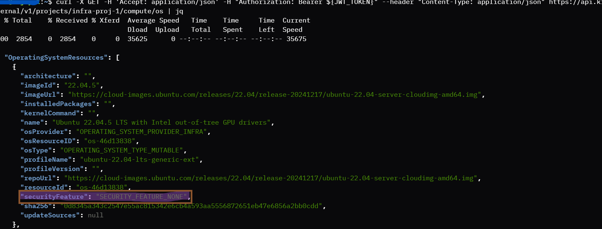
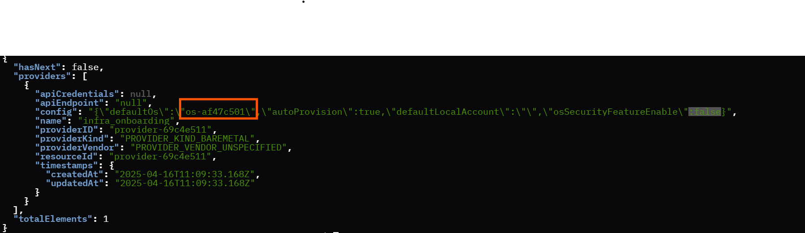
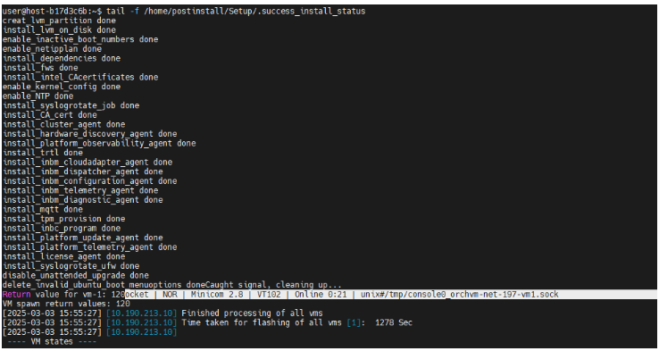
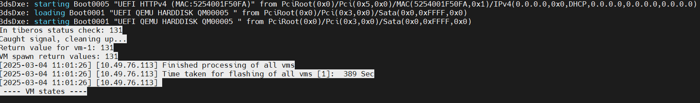
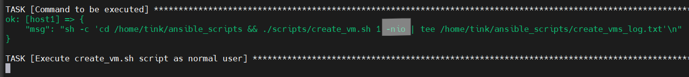
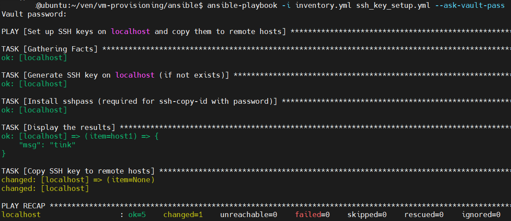
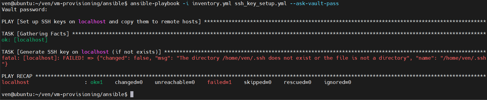
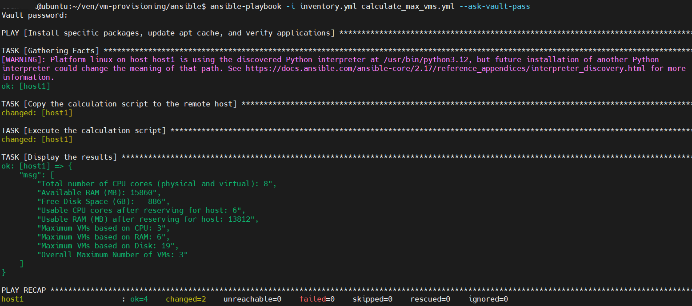
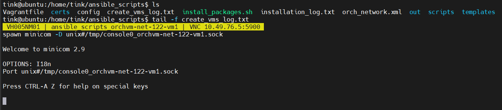

# VM Provisioning

## Table of Contents

- [Overview](#overview)
- [Features](#features)
- [Get Started](#get-started)
  - [Step 1: Prerequisites for Creating a Virtual Edge Node](#step-1-prerequisites-for-creating-a-virtual-edge-node)
    - [1.1: Minimum System Requirements](#11-minimum-system-requirements)
    - [1.2: Repository Setup](#12-repository-setup)
  - [Step 2: Proxy Settings](#step-2-proxy-settings)
  - [Step 3: User Access Setup](#step-3-user-access-setup)
  - [Step 4: Dependencies](#step-4-dependencies)
  - [Step 5: Orchestrator and Provisioning VMs Configuration](#step-5-orchestrator-and-provisioning-vms-configuration)
    - [5.1: Cluster Configuration](#51-cluster-configuration)
    - [5.2: NIO Configurations](#52-nio-configurations)
    - [5.3: VM Resource Configurations](#53-vm-resource-configurations)
    - [5.4: Linux User Configuration](#54-linux-user-configuration)
    - [Example Orchestrator and Provisioning VMs Configuration](#example-orchestrator-and-provisioning-vms-configuration)
    - [5.5: Configuration Setup](#55-configuration-setup)
  - [Step 6: Download Orchestrator Certificate](#step-6-download-orchestrator-certificate)
  - [Step 7: OS Instance and Providers](#step-7-os-instance-and-providers)
  - [Step 8: VMs Creation with Scripts](#step-8-vms-creation-with-scripts)
    - [8.1: Standalone VMs Creation](#81-standalone-vms-creation)
      - [VMs Creation with Interactive Flow (IO)](#vms-creation-with-interactive-flow-io)
      - [VMs Creation with Non-Interactive Onboarding Flow (NIO)](#vms-creation-with-non-interactive-onboarding-flow-nio)
    - [8.2: Provisioning Complete](#82-provisioning-complete)
    - [8.3: VMs Deletion](#83-vms-deletion)
  - [Step 9: Enabling VNC Access (Optional)](#step-9-enabling-vnc-access-optional)
    - [VNC Configuration Lines](#vnc-configuration-lines)
    - [Where to Add VNC Configuration](#where-to-add-vnc-configuration)
    - [Detailed Configuration Breakdown](#detailed-configuration-breakdown)
  - [VMs Creation with Ansible Scripts](#alternate-vms-creation-with-ansible-scripts)
    - [How Ansible Works](#how-ansible-works)
    - [Controller Node](#controller-node)
    - [Remote Hosts (Managed Nodes)](#remote-hosts-managed-nodes)
    - [The General Workflow](#the-general-workflow)
    - [Installation Instructions](#installation-instructions)
      - [Step 1: Select a Controller Machine](#step-1-select-a-controller-machine)
      - [Step 2: Update the Inventory and Secret Files](#step-2-update-the-inventory-and-secret-files)
        - [2.1: Updating inventory.yml](#21-updating-inventoryyml)
        - [2.2: Modify secret.yml](#22-modify-secretyml)
      - [Step 3: Orchestrator and Provisioning VMs Configuration](#step-3-orchestrator-and-provisioning-vms-configuration)
      - [Step 4: Download Orchestrator Certificate](#step-4-download-orchestrator-certificate)
      - [Step 5: Running Ansible Playbooks to Create the VM](#step-5-running-ansible-playbooks-to-create-the-vm)
      - [5.1. SSH Key Setup](#51-ssh-key-setup)
      - [5.2. Calculate Maximum VMs](#52-calculate-maximum-vms)
      - [5.3. Create VMs](#53-create-vms)
      - [Step 6: Capture Logs from Remote Hosts](#step-6-capture-logs-from-remote-hosts)
      - [6.1. Run the show_vms_data.yml Playbook](#61-run-the-show_vms_datayml-playbook)
      - [6.2. Monitor Logs in Real-Time](#62-monitor-logs-in-real-time)
- [Contribute](#contribute)

## Overview

The VM-Provisioning component serves as the heart of the repository, offering a suite of scripts that automate the setup
and pre-configuration of virtual machines. These scripts can be used on physical machines (bare metal) or within existing
virtualized environments, utilizing Vagrant and Libvirt APIs.

## Features

- Package Installation: Manages the installation of necessary packages and dependencies before VM provisioning, ensuring
a seamless setup process.
- Reference Templates: Offers predefined templates to simplify the configuration and provisioning of virtual machines (VMs).
- VM Resource Configuration: Oversees VM resources and specifies the orchestrator URL for downloading the EFI boot file.
- Provisioning Monitoring: Uses socket_login.exp to monitor and track the progress of VM provisioning in real-time.
- Ansible Scripts: Provides automation scripts for configuring and managing VMs, ensuring consistent and efficient deployment.
These scripts are also useful to perform scale tests.

## Get Started

This section provides step-by-step instructions to set up the environment required for onboarding and provisioning
virtual edge nodes.
**Important**: Intel strongly recommends using script-based installation for creating Virtual Machines to ensure a
streamlined and efficient setup process.

### Step 1: Prerequisites for Creating a Virtual Edge Node

#### 1.1: Minimum System Requirements

To ensure optimal compatibility and performance, the host machine must have either Ubuntu 22.04 or Ubuntu 24.04 LTS
installed.
The following specifications are recommended for effectively onboarding and provisioning virtual machines (VMs). The
capacity to provision multiple VMs will depend on these specifications:

- **Operating System:** Ubuntu 22.04 LTS or Ubuntu 24.04 LTS (must be installed on the host machine)
- **CPU:** 16 cores
- **Memory:** 64 GB RAM
- **Storage:** 1 TB HDD

#### 1.2: Repository Setup

Begin by cloning the repository that contains all necessary scripts and configurations for deployment. This step
is crucial for accessing the tools required for virtual edge node provisioning:

```bash
git clone https://github.com/open-edge-platform/virtual-edge-node.git
```

### Step 2: Proxy Settings

To ensure seamless connectivity with the Edge Orchestrator, it is important to configure any necessary proxy settings
on your system.
Below is an example of how to configure these proxy settings:

```bash
export http_proxy=http://proxy-dmz.mycorp.com:912
export https_proxy=http://proxy-dmz.mycorp.com:912
export socks_proxy=proxy-dmz.mycorp.com:1080
export no_proxy=.mycorp.com,.local,.internal,.controller.mycorp.corp,.kind-control-plane,.docker.internal,localhost
```

### Step 3: User Access Setup

Ensure that a user has the necessary permissions to perform administrative tasks and manage virtualization and
containerization tools. The below command adds the specified user to important groups, granting them the required
access rights.

Use the following sample command to add a user named `john` to the necessary groups:

```bash
sudo usermod -aG sudo,kvm,docker,libvirt john
```

**Note**: After running this command, the user may need to log out and log back in for the changes to take effect.

### Step 4: Dependencies

This section verifies the essential dependencies for establishing a KVM-based virtualization environment on your system.
These dependencies ensure that your system has the necessary tools and libraries to effectively manage and operate
virtual If not, you will be prompted to check your BIOS/UEFI settings to ensure that virtualization is enabled. This
section checks the necessary dependencies for setting up a KVM-based virtualization environment on the system. These
dependencies ensure that your system is equipped with the required tools and libraries to efficiently manage and run
virtual machines using KVM.

```bash
make dependency-check
```

If your system supports KVM acceleration, a confirmation message will appear: "KVM acceleration is supported on this
system." If this feature is not supported, you will be advised to review your BIOS/UEFI settings to ensure that
virtualization is enabled.

### Step 5: Orchestrator and Provisioning VMs Configuration

To customize the setup with your specific environment, open the `config` file and replace the placeholder values with
the actual values specific to your orchestrator.

#### 5.1: Cluster Configuration

- `CLUSTER="kind.internal"`: This variable is the FQDN of the orchestrator.

#### 5.2: NIO Configurations

- `PROJECT_NAME="your-project-name"` : Non Interactive Onboarding Project configurations would be used to
automatically register the dynamically created Virtual Edge Node Serial Number.

#### 5.3: VM Resource Configurations

Specify the resource allocations for virtual machines (VMs) to be provisioned.

- `RAM_SIZE=8192`: Allocates 8192 MB (or 8 GB) of RAM to each VM.
- `NO_OF_CPUS=4`: Assigns 2 CPU cores to each VM.
- `SDA_DISK_SIZE="64G"`: Sets the size of the primary disk (sda) to 64 GB.
- `SDB_DISK_SIZE="64G"`: Sets the size of the secondary disk (sdb) to 64 GB.
- `LIBVIRT_DRIVER="kvm"`: If KVM is supported, set the driver to kvm. If KVM is not supported, set the driver to qemu.

#### 5.4: Linux User Configuration

- `USERNAME="PROVISIONED_USERNAME"`: This variable represents the username for the newly provisioned Linux system. The placeholder
  "PROVISIONED_USERNAME" should be replaced with the actual username.
- `PASSWORD="PROVISIONED_PASSWORD"`: This variable holds the password for the provisioned Linux user. The placeholder
  "PROVISIONED_PASSWORD" should be replaced with the actual password.

#### Example Orchestrator and Provisioning VMs Configuration

Here's an example of how you might update the fields in a `config` file:

```bash
# Cluster FQDN
CLUSTER="kind.internal"

# NIO Configurations
PROJECT_NAME="your-project-name"

# VM Resources
RAM_SIZE=8192
NO_OF_CPUS=4
SDA_DISK_SIZE="64G"
SDB_DISK_SIZE="64G"
LIBVIRT_DRIVER="kvm"

# Linux Provisioning
USERNAME="actual_linux_user"
PASSWORD="actual_linux_password"
```

#### 5.5: Configuration Setup

##### Interactive Onboarding Flow (IO) Configurations

Before running the IO flow script, export the onboarding username and password:

```bash
export ONBOARDING_USERNAME="ONBOARDING_USER"
export ONBOARDING_PASSWORD="ONBOARDING_PASSWORD"
```

- `ONBOARDING_USERNAME="ONBOARDING_USER"`: This variable represents the username to start IO flow. The
placeholder "ONBOARDING_USER" should be replaced with the actual username.
- `ONBOARDING_PASSWORD="ONBOARDING_PASSWORD"`: This variable holds the password for the onboarding user. The placeholder
"ONBOARDING_PASSWORD" should be replaced with the actual password.

##### Non Interactive Onboarding Flow (NIO) Configurations

Non Interactive Onboarding Project and User Configurations. These configurations would be used to automatically register
the dynamically created Virtual Edge Node Serial Number.

Before running the NIO flow script, export the project API username and password:

```bash
export PROJECT_API_USER="your_project_api_username"
export PROJECT_API_PASSWORD="your_project_api_password"
```

- `PROJECT_NAME="your-project-name"`: This variable specifies the name of the project associated with the non interactive
onboarding flow configurations.
- `PROJECT_API_USER="actual_api_user"`: This variable indicates the username for accessing an API.
- `PROJECT_API_PASSWORD=""`: This variable is intended to store the password for the API user. It is currently empty and
shouldbe populated with the actual password

**Note**: If you do not export these credentials, the script will prompt you to enter them when you run the
`create_vms.sh` script.

### Step 6: Download Orchestrator Certificate

To download the Full_server.crt file and save it in the certs directory, follow these steps using wget.

#### Example command to download certificate

Here's an example of how to download the file into the certs directory:

```bash
source ./config
wget https://"tinkerbell-nginx.${CLUSTER}"/tink-stack/keys/Full_server.crt --no-check-certificate -O certs/"Full_server.crt"
```

### Step 7: OS Instance and Providers

VM based provisioning doesn't support secureboot. It needs `"securityFeature":"SECURITY_FEATURE_NONE"` during instance creation.
Use the following curl to create an OS instance and Provider instance.

**Note: The following commands are required to run initially when starting VM provisioning. These configurations will be
used for further VM provisioning.**

```sh
cd vm-provisioning

1. Source the configuration file
source ./config

2. Obtain the JWT token 
export JWT_TOKEN=$(curl --location --insecure --request POST "https://keycloak.${CLUSTER}/realms/master/protocol/openid-connect/token" \
--header 'Content-Type: application/x-www-form-urlencoded' \
--data-urlencode 'grant_type=password' \
--data-urlencode 'client_id=system-client' \
--data-urlencode "username=${PROJECT_API_USER}" \
--data-urlencode "password=${PROJECT_API_PASSWORD}" \
--data-urlencode 'scope=openid profile email groups' | jq -r '.access_token')

3. Sample configuration to create a provider with an OS instance:
curl -X POST "https://api.${CLUSTER}/v1/projects/${PROJECT_NAME}/providers" -H "accept: application/json" \
-H "Content-Type: application/json" -d '{"providerKind":"PROVIDER_KIND_BAREMETAL","name":"infra_onboarding", \
"apiEndpoint":"xyz123", "apiCredentials": ["abc123"], "config": "{\"defaultOs\":\"os-51c4eba0\",\"autoProvision\":true}" }' \
-H "Authorization: Bearer ${JWT_TOKEN}"
```

### Step 8: VMs Creation with Scripts

Currently, VM onboarding and provisioning are supported only for OS profiles (Ubuntu/Microvisor) where the security
feature is set to `SECURITY_FEATURE_NONE`, and the selected OS profile must be set as the default in the provider config.




#### 8.1: Standalone VMs Creation

This section provides instructions for creating one or more virtual machines (VMs) on an orchestrator using predefined
scripts from the host machine where the VMs will be created.

##### VMs Creation with Interactive Flow (IO)

To create a specified number of VMs, execute the following command:

```bash
./scripts/create_vm.sh <NO_OF_VMS>
```

- `NO_OF_VMS`: Replace this placeholder with the actual number of VMs you wish to create.

Note: You can press Ctrl+C to cancel the ongoing VM provisioning process, whether it is in progress or completed.

##### VMs Creation with Non-Interactive Onboarding Flow (NIO)

To create VMs using the Non-interactive onboarding flow, use the following command:

```bash
./scripts/create_vm.sh <NO_OF_VMS> -nio
```

- `NO_OF_VMS`: Replace this placeholder with the actual number of VMs you wish to create.
- `-nio`: This option enables the Non Interactive Onboarding flow.

**Note: You can press Ctrl+C to cancel the ongoing VM provisioning process, whether it is in progress or completed.
Already provisioned VMs or ongoing provisioning VMs shall be deleted.**

#### 8.2: Provisioning Complete

Upon successful provisioning with Ubuntu OS, the following log will appear on your terminal.
 

Upon successful provisioning with MicroVisor, the following log will appear on your terminal.
 

#### 8.3: VMs Deletion

Run the `destroy_vm.sh` script to delete VMs that have already been provisioned.

```bash
./scripts/destroy_vm.sh
```

### Step 9: Enabling VNC Access (Optional)

By default, VNC access is not enabled in the Vagrantfile to ensure security and simplicity. If you wish to enable VNC
access to your virtual machines, you can do so by adding the following lines to your Vagrantfile.

#### VNC Configuration Lines

Add the following lines within the libvirt block to enable VNC access:

```bash
libvirt.graphics_type = "vnc"
libvirt.video_type = 'qxl'
libvirt.graphics_ip = "0.0.0.0" # Optional: specify the VNC listen address
libvirt.graphics_port = "5900"  # Optional: specify the VNC port
libvirt.graphics_password = "abc" # Optional: set a password for VNC access
```

#### Where to Add VNC Configuration

Locate the section in templates/Vagrantfile where the libvirt provider is configured for each virtual machine. You will find
a block similar to the one below:

```bash
Vagrant.configure("2") do |config|
  (1..num_vms).each do |i|
    config.vm.define "#{VM_NAME}#{i}" do |vm_config|
      vm_config.vm.provider "libvirt" do |libvirt|
        # Existing configuration lines
        libvirt.title = "orchvm-net-000-vm#{i}"
        libvirt.driver = LIBVIRT_DRIVER
        libvirt.management_network_name = "orchvm-net-000"
        libvirt.memory = RAM_SIZE
        libvirt.cpus = NO_OF_CPUS
        **# Add VNC configuration lines here**
      end
    end
  end
end
```

#### Detailed Configuration Breakdown

- libvirt.graphics_type = "vnc": Sets the graphics type to VNC, enabling remote graphical access to the virtual machine.
- libvirt.video_type = 'qxl': Configures the video type to qxl, optimized for virtualized environments.
- libvirt.graphics_ip = "0.0.0.0": Specifies that the VNC server should listen on all network
interfaces, allowing remote access from any IP address.
- libvirt.graphics_port = "5900": Sets the port for VNC access. VNC typically uses port 5900 by default.
- libvirt.graphics_password = "abc": Sets a password for VNC access, adding a layer of security to prevent unauthorized access.

## (Alternate) VMs Creation with Ansible Scripts

### How Ansible Works

Ansible automates tasks like provisioning, configuration management, and application deployment across multiple systems.
Ansible is agentless, using SSH to communicate with remote hosts without needing additional software on them.

It operates with two main components: the Controller Node and Remote Hosts.

#### Controller Node

- The machine where Ansible is installed and tasks are executed is responsible for running playbooks to manage configurations.

#### Remote Hosts (Managed Nodes)

- The systems managed by Ansible, where tasks are applied via SSH without needing additional software.

#### The General Workflow

- Install Ansible on the controller node using the appropriate package manager.
- Create an Inventory File listing the remote machines to manage.
- Configure SSH Access with key-based authentication for secure communication.
- Run Playbooks to automate tasks like copying SSH keys and launching VMs on the remote hosts.

### Installation Instructions

#### Step 1: Select a Controller Machine

To set up Ansible, first choose a controller machine to run playbooks.

Install Ansible on Controller Node using the install_ansible.sh script that is available in ansible directory.

```bash
./install_ansible.sh
```

To allow a file or folder to be executed, you need to modify its permissions using the chmod command.
This is particularly useful for scripts or programs that need to be run directly

```bash
chmod +x /path/to/your/file
```

**Example:** chmod +x install_ansible.sh

#### Step 2: Update the Inventory and Secret Files

##### 2.1: Updating inventory.yml

This file lists all remote hosts (managed nodes) Ansible will control, grouping them by categories.

- Define ansible_vm_deploy_scripts: Specify paths to the all directories and files on the controller
for VM deployment scripts. Ensure these exist and set the path in `inventory.yml`.

```bash
ansible_vm_deploy_scripts: /home/guest/directory1 /home/guest/directory2 /home/guest/file1
```

**Example:** ansible_vm_deploy_scripts: /home/guest/ven/vm-provisioning/scripts
/home/guest/ven/vm-provisioning/templates /home/guest/ven/vm-provisioning/certs
/home/guest/ven/vm-provisioning/config /home/guest/ven/vm-provisioning/install_packages.sh

- Define ansible_secret_file_path: which stores the passwords for the hosts. The file must be
located in the same directory as the Ansible playbooks. Specify its path in `inventory.yml`:

```bash
ansible_secret_file_path: /home/guest/ven/vm-provisioning/ansible/secret.yml
```

- Define ansible_timeout_for_create_vm_script: This variable defines the timeout for the
deployment of all VMs (Value in seconds).

```bash
ansible_timeout_for_create_vm_script: 14400
```

- Define ansible_timeout_for_install_vm_dependencies: This variable defines the timeout for the
installation of packages (Value in seconds).

```bash
ansible_timeout_for_install_vm_dependencies: 6000
```

- Define the correct IP address of remote host.

```bash
ansible_host: 10.xx.xx.xx
```

- Define the correct user on remote host.

```bash
ansible_user: guest
```

- Default configuration.

```bash
ansible_password: "{{ host1_sudo_password }}"
ansible_become: yes
ansible_become_pass: "{{ host1_sudo_password }}"
ansible_become_method: sudo
ansible_become_user: root
```

- Define the desired copy_path on the remote host where you wish to copy the script. If the specified
copy_path does not exist, it will be created automatically during the script execution.

```bash
copy_path: "/home/{{ ansible_user }}/ansible_scripts"
```

- Set the number of VM to create.

```bash
number_of_vms: 3
```

- Set install_packages: Set this to a non-zero value to install the necessary dependent packages on the remote
host for creating a VM.

```bash
install_packages: 1
```

**NOTE:** Set this to zero if the packages are already installed and you do not want to update them.

- Set nio_flow: true for Automated Onboarding(NIO flow), False for Engaged onboarding flow (IO flow).

```bash
nio_flow: false
```

 

##### Example: inventory.yml

```bash
ansible_vm_deploy_scripts: /home/guest/ven/vm-provisioning/scripts /home/guest/ven/vm-provisioning/templates /home/guest/ven/vm-provisioning/certs /home/guest/ven/vm-provisioning/config /home/guest/ven/vm-provisioning/install_packages.sh
ansible_secret_file_path: /home/guest/ven/vm-provisioning/ansible/secret.yml
ansible_timeout_for_create_vm_script: 14400
ansible_timeout_for_install_vm_dependencies: 6000
ansible_host: 10.49.76.113
ansible_user: guest
ansible_password: "{{ host1_sudo_password }}"
ansible_become: yes
ansible_become_pass: "{{ host1_sudo_password }}"
ansible_become_method: sudo
ansible_become_user: root
copy_path: "/home/{{ ansible_user }}/ansible_scripts"
number_of_vms: 1
install_packages: 1
nio_flow: false
```

##### 2.2: Modify secret.yml

In the `secret.yml` file, define the passwords for each host that is listed in the `inventory.yml`.
This is critical for Ansible to authenticate with the remote hosts.

##### Encrypt secret.yml

- Define the passwords and encrypt the `secret.yml` file to keep the sensitive information secure.

```bash
ansible-vault encrypt secret.yml
```

You will be prompted to set a password for the vault. This password will be required whenever the playbooks are run.
Important: To make the above command work, you need to switch to the root user.

##### Modify the Encrypted secret.yml

If you need to make changes to the `secret.yml` file later, you can decrypt it using:

```bash
ansible-vault decrypt secret.yml
```

After making your changes, you can re-encrypt the file.

#### Step 3: Orchestrator and Provisioning VMs Configuration

Follow the above [Step 5: Orchestrator and Provisioning VMs Configuration](#step-5-orchestrator-and-provisioning-vms-configuration)
steps to set the config file.

#### Step 4: Download Orchestrator Certificate

Follow the above [Step 6: Download Orchestrator Certificate](#step-6-download-orchestrator-certificate)
steps to download the `Full_server.crt` certificate file in the `certs` directory.

#### Step 5: Running Ansible Playbooks to Create the VM

In this step, you will execute the Ansible playbooks to automate the creation of the virtual machine.
Ensure that all previous configuration steps have been completed before proceeding.

**Important:** Log in as the root user before running any playbooks. Root access is required to use
the `secret.yml` file for passwords and to execute the playbooks.

##### 5.1. SSH Key Setup

Ensure the controller can connect to the remote machines via SSH. You'll typically want to use SSH keys
to avoid needing to enter passwords for every connection. Before creating the VMs,
you must run the `ssh_key_setup.yml` playbook.
This playbook copies your SSH key to all the hosts, allowing passwordless SSH login:

```bash
ansible-playbook -i inventory.yml ssh_key_setup.yml --ask-vault-pass
```

 

This eliminates the need to enter a password when logging into the hosts defined in the `inventory.yml` file.

**NOTE:** Use the following command to create the .ssh directory in your home directory if it doesn't already exist

 

```bash
mkdir -p ~/.ssh
```

##### 5.2. Calculate Maximum VMs

After setting up SSH keys, run the `calculate_max_vms.yml` playbook. This playbook will help you determine the maximum number
of VMs you can deploy on each host:

```bash
ansible-playbook -i inventory.yml calculate_max_vms.yml --ask-vault-pass
```

 

If you encounter permission, follow this [Step 3: User Access Setup](#step-3-user-access-setup) section.

Review the logs to see how many VMs can be deployed on each host. Based on this information, you can set the appropriate
number of VMs in the `number_of_vms` variable for each host.

##### 5.3. Create VMs

After defining the number of VMs, you can execute the create_vms.yml playbook to deploy the specified number of VMs
according to the data in the inventory.yml file. The create_vms.yml script carries out the following actions:

- Remove directories on remote hosts.
- Use rsync to synchronize directories from the source to the target machine.
- Install specific packages, update the apt cache, and verify applications.
- Clean up VMs and networks.
- Determine the maximum number of VMs for each host.
- Execute the create_vms.yml script for Engaged or Automated onboarding flow and save the log.

```bash
ansible-playbook -i inventory.yml create_vms.yml --ask-vault-pass
```

This command will prompt you to enter the vault password for the encrypted `secret.yml` file.

#### Step 6: Capture Logs from Remote Hosts

To efficiently gather logs from all remote machines and transfer them to the directory where the
create_vms.yml playbook is executed, follow these steps:

##### 6.1. Run the show_vms_data.yml Playbook

Execute the `show_vms_data.yml` playbook in a separate terminal window immediately after
starting the `create_vms.yml` playbook. This will ensure that logs are captured concurrently.

```bash
ansible-playbook -i inventory.yml show_vms_data.yml --ask-vault-pass
```

After a playbook is executed on a specific host, the logs are saved in the same directory from which the playbook was run.

##### 6.2. Monitor Logs in Real-Time

While the create_vms.yml playbook is running, you can log into the remote host where the playbook
is being executed. Navigate to the directory specified by the copy_path variable in the inventory.yml
file to view the create_vms_log.txt log. This log is generated in real-time as VMs are created.

```bash
tail -f create_vms_log.txt
```

 

## Contribute

To learn how to contribute to the project, see the
[contributor's guide][contributors-guide-url]. The project will accept
contributions through Pull-Requests (PRs). PRs must be built successfully by the CI pipeline, pass linters verifications
and the unit tests.

There are several convenience make targets to support developer activities, you can use `help` to see a list of makefile
targets.

The following is a list of makefile targets that support developer activities:

- `lint` to run a list of linting targets

To learn more about internals and software architecture

[contributors-guide-url]: https://literate-adventure-7vjeyem.pages.github.io/edge_orchestrator/user_guide_main/content/user_guide/index.html
