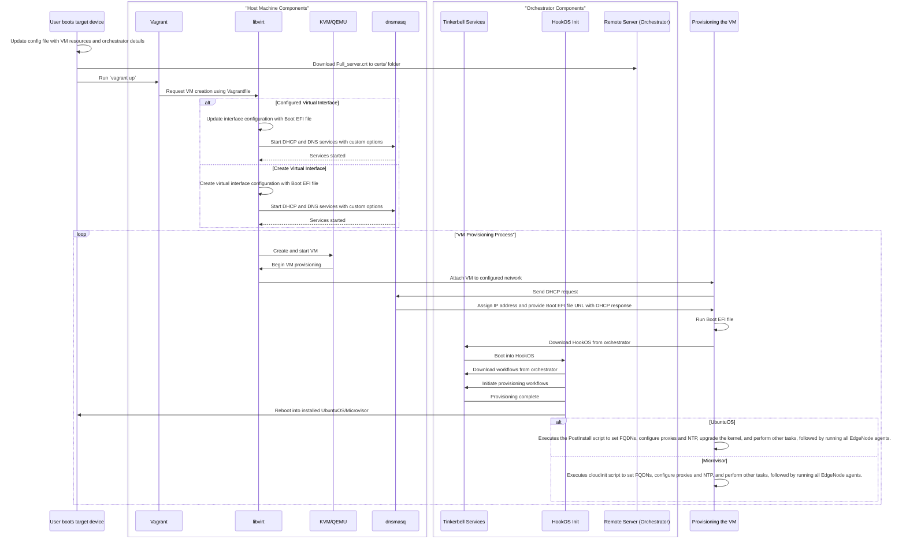

# Architecture

The architecture of vm-provisioning involves several components working together to automate the onboarding and
provisioning of virtual machines (VMs) from Day-0 and deleting VMs using Vagrant and Libvirt APIs.

## Provisioning of VMs on Any Bare Metal Machine / Any VM

This document describes the architecture for Day-0 provisioning of VMs on bare metal or any virtual machine using
shell scripts, Vagrant, and Libvirt APIs.

### High-level Architecture Diagram

 

#### Vagrant

Vagrant is a tool for automating the creation and configuration of virtualized environments. It uses a file called
Vagrantfile to define VMs, including resources, network settings, and provisioning scripts.

- It communicates with Libvirt through a Vagrant provider plugin called `vagrant-libvirt`.
- The Vagrantfile specifies the use of the Libvirt provider, which allows Vagrant to interact with Libvirt APIs to
manage VMs.
- Vagrant sends requests to Libvirt to create, configure, start, and stop VMs based on the Vagrantfile specifications.

#### Libvirt

Libvirt is an open-source API, daemon, and management tool for managing platform virtualization.
It provides a unified interface to interact with different hypervisors, including QEMU/KVM.

- Libvirt receives VM management requests from Vagrant via the Libvirt provider plugin.
- It processes these requests using its APIs and manages the underlying virtualization resources accordingly.
- Libvirt uses QEMU as the hypervisor to run the VMs. It translates the high-level VM management requests from Vagrant
into specific commands that QEMU can execute.
- Libvirt manages the lifecycle of VMs, including resource allocation, network configuration,
and storage management, by interfacing with QEMU.

#### QEMU

QEMU is a generic and open-source machine emulator and virtualizer. When used with KVM, it provides efficient virtualization
by leveraging hardware acceleration.

- QEMU acts as the execution engine for VMs, running the virtual machines as specified by Libvirt.
- Libvirt configures QEMU with the necessary parameters, such as CPU, memory, disk, and network settings,
to start and manage the VMs.
- When KVM is supported, QEMU communicates with KVM to offload CPU virtualization tasks.
- QEMU is responsible for emulating I/O devices, such as disk controllers and network interfaces, providing a complete
virtual hardware environment.

#### KVM (Kernel-based Virtual Machine)

It allows the Linux kernel to function as a hypervisor, enabling multiple virtual machines (VMs) to run on a single
physical host.

- KVM leverages hardware virtualization extensions available in modern CPUs, such as Intel VT-x and AMD-V, to provide
efficient and high-performance virtualization.
- KVM can efficiently manage multiple VMs on a single host, scaling from small to large deployments.
- It supports secure boot and other UEFI features when used with OVMF (Open Virtual Machine Firmware).
- KVM is often used in conjunction with QEMU, a user-space emulator and virtualizer, to provide a complete virtualization
solution.
- QEMU handles I/O device emulation, while KVM provides hardware-accelerated CPU virtualization.

#### Host OS kernel

The host OS kernel manages system resources, such as CPU, memory, and I/O devices, and provides services to applications
and processes running on the host.

- QEMU requests resources from the host OS kernel, such as memory allocation and access to I/O devices.
- QEMU uses system calls to interact with the host OS kernel.
- QEMU accesses host devices through the kernel, using device drivers to perform operations like reading
from or writing to disk and sending or receiving network packets.

#### Create VM script

The Create VM Script is designed to automate the process of setting up virtual machines (VMs) using a combination
of Docker and virsh tools.

- The script uses the `vagrantlibvirt/vagrant-libvirt:edge-slim` Docker image, setting up an environment where Vagrant
and Libvirt can operate.
- Vagrant uses a configuration file called a Vagrantfile to define the VM's properties, such as network configuration, and
resource allocations.
- Using the Libvirt provider, Vagrant communicates with the Libvirt API to spawn and configure the VMs according to the
specifications in the Vagrantfile.
- Virsh is a CLI tool for managing VMs through Libvirt. The script utilizes this tool to define the virtual bridge network
specified in the Vagrantfile.
- VNC Server must be running on the machine to interact with the VNC Viewer for seeing the progress
of the provisioning process.
- Minicom is used to connect to the serial console of a virtual machine or a physical device. This is very useful for
monitoring boot messages, kernel logs, hook OS logs, and other system outputs that are sent to the serial console.

#### Delete VM Script

The Delete VM script is designed to remove virtual machines by utilizing virsh commands.
This involves commands such as `virsh destroy` to stop the VM if it is running, and `virsh undefine`
to remove its configuration from the system.
The script also handles the cleanup of associated files. These files may include disk images, configuration files,
and any other resources allocated to the VM.

### Sequence Diagram

### Network Flow Diagrams

 

 
